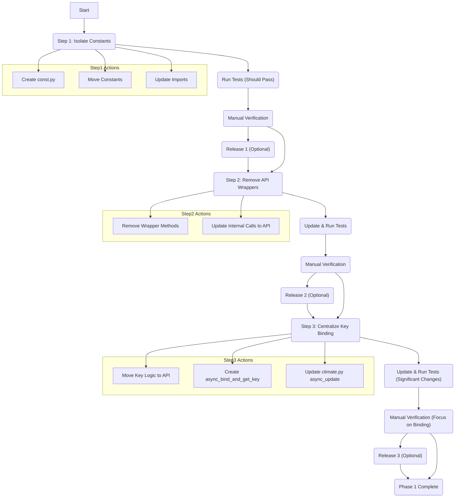

# Refactoring Plan: climate.py (Incremental Steps)

This plan outlines the steps to refactor `custom_components/greev2/climate.py` into smaller, more manageable parts, allowing for testing and potential releases between steps.

**Goal:** Improve code organization, maintainability, and separation of concerns.

**Visual Plan:**

---

## Step 1: Isolate Constants

*   **Goal:** Move all constants out of `climate.py` into a dedicated `const.py` file.
*   **Actions:**
    1.  Create `custom_components/greev2/const.py`.
    2.  Identify and move all global constants (e.g., `DEFAULT_NAME`, `CONF_*`, `MIN/MAX_TEMP`, `SCAN_INTERVAL`, `TEMP_OFFSET`, `HVAC_MODES`, `FAN_MODES`, `SWING_MODES`, `PRESET_MODES`, `GCM_*`, `SUPPORT_FLAGS`) from `climate.py` to `const.py`.
    3.  Update `climate.py` to import these constants from `.const`.
    4.  Update `device_api.py` (if it uses any shared constants like `GCM_*`) to import from `.const`.
*   **Testing & Verification:**
    *   Run the existing test suite (`pytest tests/`). All tests should pass without modification.
    *   Manually verify the component loads and basic operations function in a Home Assistant test instance.
*   **Release Point:** Yes.

---

## Step 2: Remove API Call Wrappers

*   **Goal:** Eliminate the redundant wrapper methods in `climate.py` that just call `device_api.py`.
*   **Actions:**
    1.  In `climate.py`, remove the methods `gree_get_values` and `send_state_to_ac`.
    2.  Replace internal calls to `self.gree_get_values(...)` with direct calls to `self._api.get_status(...)`. Ensure arguments match.
    3.  Replace internal calls to `self.send_state_to_ac()` with direct calls to `self._api.send_command(...)`. Ensure arguments match.
*   **Testing & Verification:**
    *   Run the existing test suite (`pytest tests/`). Adjust mocks as needed to target `device_api.GreeDeviceApi.get_status` and `device_api.GreeDeviceApi.send_command`. Ensure all tests pass.
    *   Manually test all climate functions in HA. Behavior should be identical.
*   **Release Point:** Yes.

---

## Step 3: Centralize Key Binding/Retrieval in API

*   **Goal:** Move the responsibility of device binding and encryption key management entirely into `device_api.py`.
*   **Actions:**
    1.  **Refactor `device_api.py`:**
        *   Move the core logic from `climate.py`'s `get_device_key` and `get_device_key_gcm` into new *private* methods (e.g., `_bind_and_get_key_v1`, `_bind_and_get_key_v2`).
        *   Create a new *public* method `async def async_bind_and_get_key(self) -> bool:` that calls the appropriate private method based on `_encryption_version`, handles exceptions, stores the key, sets `_is_bound`, initializes the cipher (V1), and returns `True`/`False`.
        *   Modify `__init__` to accept optional `encryption_key`, initialize `self._is_bound` accordingly.
        *   Add `self._is_bound` checks in `send_command` and `get_status`.
    2.  **Refactor `climate.py`:**
        *   Remove the original `get_device_key` and `get_device_key_gcm` methods.
        *   Modify `async_update` (and `_update_sync`) to check `self._api._is_bound` and call `await self._api.async_bind_and_get_key()` if needed, handling the boolean result to manage `_device_online` and potentially stop the update on failure.
*   **Testing & Verification:**
    *   **Update Tests:** Refactor tests mocking old key methods. Add mocks for `async_bind_and_get_key` and `_is_bound`. Add new tests for `async_bind_and_get_key` itself.
    *   Run the updated test suite (`pytest tests/`). All tests must pass.
    *   Manually test the initial connection/binding process thoroughly in HA. Test subsequent operations.
*   **Release Point:** Yes.

---

**(Future Consideration: Phase 2 - DataUpdateCoordinator)**
After completing these steps, consider implementing `DataUpdateCoordinator` for further simplification and adherence to HA best practices.